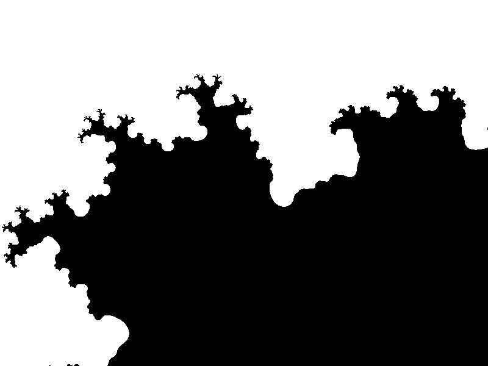

# Fractal Generator

A collection of Python scripts for generating various fractals and terrain using classic algorithms.

## 📂 Project Structure

- `Mandelbrot.py` — Mandelbrot Set Generator

Generates an image of the Mandelbrot set using complex number iteration.
Each pixel represents a complex number and is colored based on how quickly the iteration diverges.
Black areas belong to the set; colored areas visualize escape time.
The script produces a detailed black-and-white fractal image.
It is a classic example of visualizing mathematical chaos and infinite complexity.

- `Diamond_square.py` — Diamond-Square Algorithm

Implements the Diamond-Square algorithm for generating 2D fractal terrain.
It starts with a grid and recursively applies averaging and randomness to generate height values.
The algorithm simulates realistic elevation maps, useful for game terrain.
Randomness decreases with each iteration to create fine details.
The output is a grayscale heightmap representing terrain structure.

- `Midpoint_displacement.py` — Midpoint Displacement

Uses the Midpoint Displacement algorithm to generate 1D or 2D fractal shapes.
The method divides a segment, displaces the midpoint, and repeats recursively.
Ideal for creating jagged, natural forms like mountains or coastlines.
The randomness level decreases with each subdivision for finer structure.
This technique is simple yet effective in procedural generation.

- `mid2.py` — Additional experimental fractal code.
- `Mandelbrot_set.jpeg` — Sample output image of the Mandelbrot set.

## 🖼️ Example

## 🚀 How to Run

You can run any of the fractal generators with Python 3
